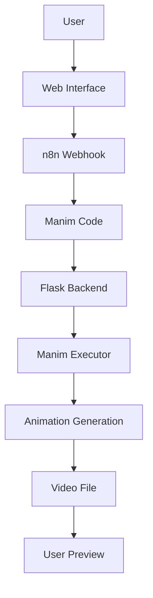

# Architecture Overview

## System Components

The Manim Animation Generator consists of three main components that work together to create mathematical animations from natural language descriptions:

### 1. Frontend (Web Interface)

- **Technology**: HTML, CSS, JavaScript with CodeMirror editor
- **Location**: `templates/index.html`
- **Features**:
  - Natural language input field
  - Code editor with syntax highlighting
  - Example animations library
  - Real-time animation preview
  - Responsive design with dark theme

### 2. Backend (Flask Server)

- **Technology**: Python Flask
- **Location**: `app.py`
- **Features**:
  - Serves the web interface
  - Handles API requests
  - Manages animation generation workflow
  - Streams generated videos to the frontend

### 3. Animation Engine (Manim Executor)

- **Technology**: Python with Manim library
- **Location**: `manim_executor.py`
- **Features**:
  - Executes Manim scripts
  - Manages temporary files and directories
  - Optimizes rendering performance
  - Handles error reporting

## Data Flow



## Integration with n8n

The application integrates with n8n workflow automation to convert natural language descriptions into Manim code:

1. User enters a description in the web interface
2. The frontend sends the description to an n8n webhook
3. n8n processes the request using AI/ML models to generate appropriate Manim code
4. The generated code is returned to the frontend
5. User can review/edit the code before execution
6. When "Generate Animation" is clicked, the code is sent to the Flask backend
7. The backend executes the code using Manim
8. The generated animation is streamed back to the frontend for preview

## File Structure and Management

### Generated Animations Directory

- **Location**: `anim_generated/`
- **Purpose**: Stores all generated animations in separate subdirectories
- **Cleanup**: Each subdirectory is isolated and can be easily removed

### Temporary Files

- **Management**: Each animation generation creates a unique temporary directory
- **Cleanup**: Directories are not automatically deleted to allow for debugging
- **Manual Cleanup**: Users can remove old directories as needed

## API Endpoints

### Frontend Routes

- `GET /` - Serves the main web interface

### API Routes

- `POST /api/generate` - Receives Manim script and returns video URL
- `GET /video/latest` - Streams the latest generated video

### Request/Response Format

#### Generate Animation Request
```json
{
  "script": "from manim import *\n\nclass ExampleScene(Scene):\n    def construct(self):\n        circle = Circle()\n        self.play(Create(circle))"
}
```

#### Generate Animation Response
```json
{
  "video_url": "/video/latest"
}
```

## Performance Optimization

### Manim Execution Flags

The application uses several optimization flags to speed up animation generation:

- `-ql` - Low quality rendering for faster generation
- `--disable_caching` - Disables caching to prevent memory issues
- `--progress_bar none` - Disables progress bar for cleaner output
- `--flush_cache` - Flushes cache to prevent memory buildup
- `--max_files_cached=0` - Prevents file caching

### Code Sanitization

Before executing any Manim script, the system performs sanitization to:

1. Remove invalid parameters from Arrow and CurvedArrow constructors
2. Fix Code object parameters
3. Handle VoiceoverScene to Scene conversions
4. Remove AzureService and related code blocks

## Error Handling

### Frontend Errors

- Network errors with n8n webhook
- Invalid responses from n8n
- Video loading errors
- User input validation

### Backend Errors

- Manim execution failures
- File system errors
- Invalid script errors
- Resource limitations

### Animation Errors

- Empty video files
- Corrupted video files
- Missing dependencies
- Insufficient system resources

## Security Considerations

### Code Execution Safety

While the application executes user-provided code, it's designed for local use with the following considerations:

1. **Local Execution**: Runs only on the user's machine
2. **No Remote Code**: Does not accept code from remote sources without user review
3. **Sandboxing**: Each execution runs in an isolated temporary directory
4. **User Review**: Users can review generated code before execution

### File System Access

- **Limited Access**: Only accesses files within the application directory
- **No System Files**: Does not access system or user files outside the application scope
- **Controlled Output**: Generated files are stored in designated directories